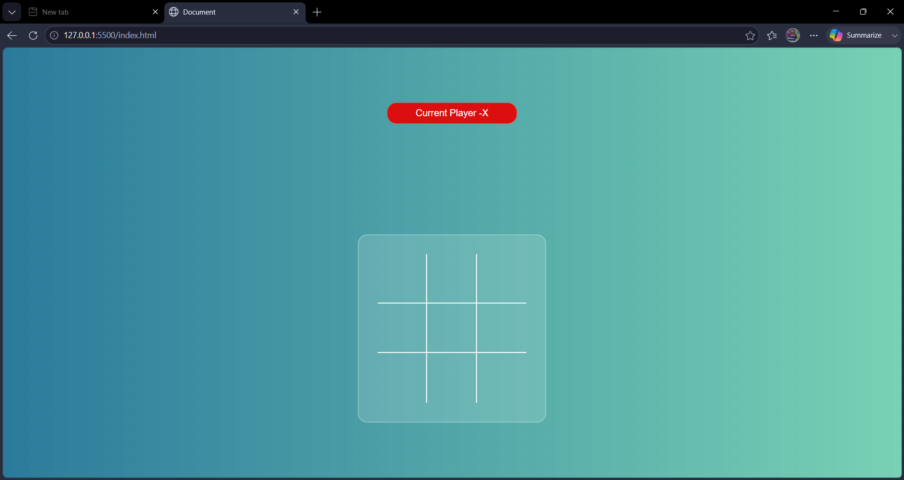
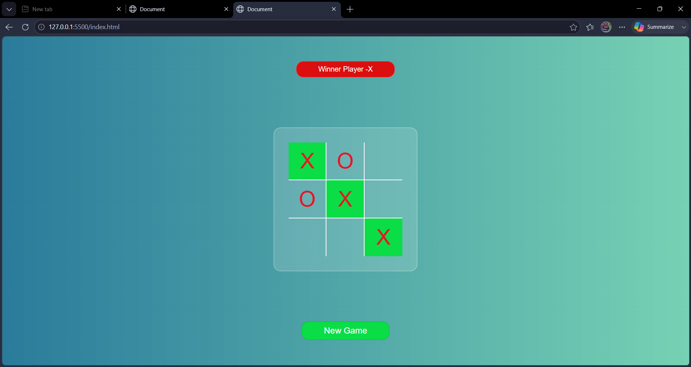

# Tic Tac Toe Game

A simple Tic Tac Toe game built using HTML, CSS and JavaScript.

## Features

- Two-player gameplay
- Winner detection
- Draw detection
- New Game functionality

## Technologies Used

- HTML
- CSS
- JavaScript

## Project Structure

```text
tic-tac-toe/
├── index.html
├── style.css
├── index.js
├── images/
└── README.md
```

## How to Run

1. Download or clone the repository.
2. Open index.html in your browser.
3. Start playing.

## Screenshots




# Live Link
https://tic-tac-toe-delta-teal-89.vercel.app/

## Author

Anurag Tiwari